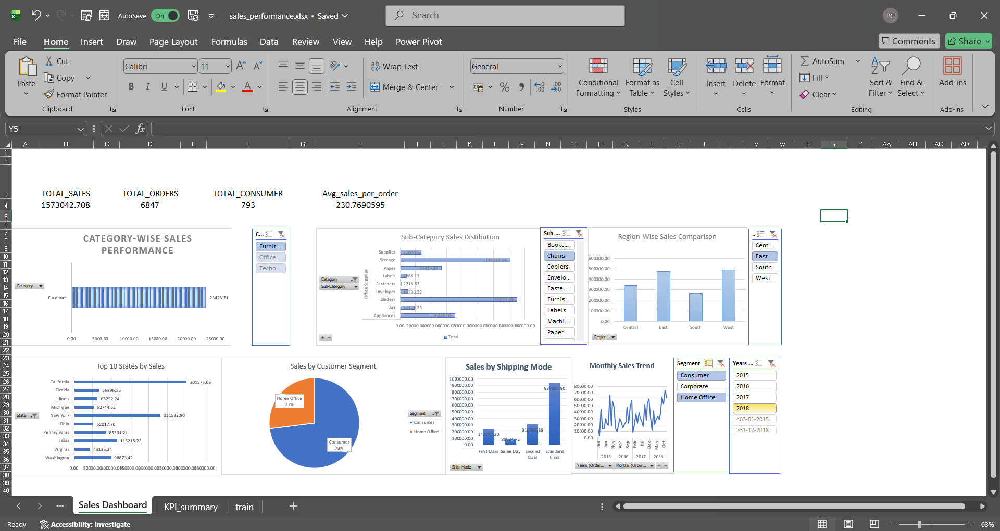
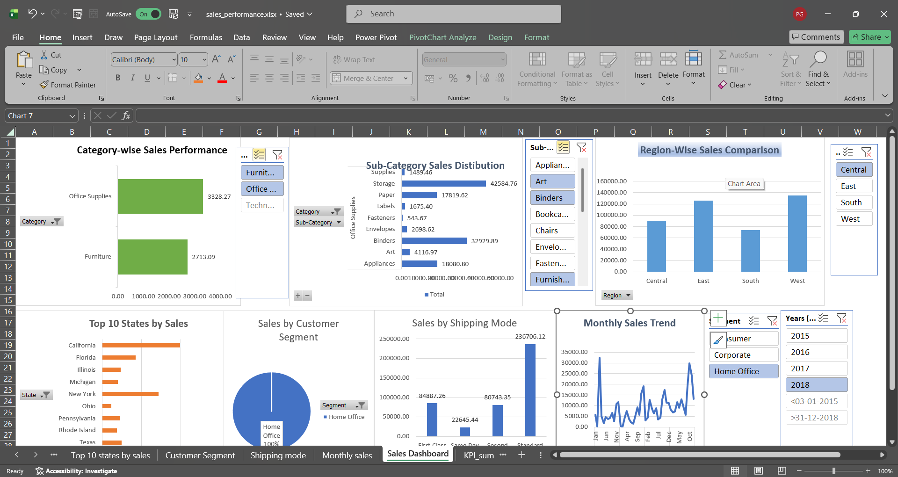

📊 Sales Performance Dashboard | Excel Project
Excited to share my end-to-end Sales Performance Analysis Dashboard built using Microsoft Excel!
 This project focuses on transforming raw sales data into meaningful KPIs and business insights for decision-making.
📌 Project Objective
To analyze sales performance across categories, regions, customer segments, shipping modes, and time using interactive dashboards and KPIs.
📂 Data Source
Dataset collected from Kaggle
Raw transactional sales data (multi-year)
🧹 Data Cleaning & Preparation Steps
✔ Removed duplicate records
✔ Handled missing values using:
Blank removal where data was irrelevant
Logical replacements where required
 ✔ Standardized column names
 ✔ Ensured correct data types (dates, numeric fields)
 ✔ Created calculated fields for KPI analysis
 ✔ Validated data consistency before analysis
📊Key KPIs Designed
Total Sales – Overall revenue performance
Total Orders – Order volume analysis
Total Customers – Customer reach
Average Sales per Order – Efficiency metric
KPIs provide a quick snapshot of overall business performance and dynamically update using slicers.
📈 Dashboard Features
Category-wise & Sub-category sales analysis
Region-wise sales comparison
Top 10 states by sales
Customer segment distribution
Shipping mode performance
Monthly sales trend analysis
Interactive slicers for Year, Region, Segment, Category
🔍 Key Business Insights
📌 West and East regions contribute the highest sales
 📌 Consumer segment generates maximum revenue
 📌 Office Supplies outperform other categories in total sales.
 📌Standard Class shipping is the most preferred shipping mode.
 📌Sales peak during year-end months, showing clear seasonality trends.
 📌California and New York are among the top-performing states by sales.
🛠 Tools & Techniques Used
Microsoft Excel
Pivot Tables & Pivot Charts
Power Pivot
KPIs
Slicers & Interactive Filters
Dashboard Design Principles
🎯 Outcome
An interactive, decision-support dashboard that enables stakeholders to:
Track performance quickly
Identify trends and opportunities
Make data-driven business decisions
✨ This project strengthened my skills in data cleaning, KPI design, dashboarding, and business analysis.
## 📸 Dashboard Screenshots

  

  

  

